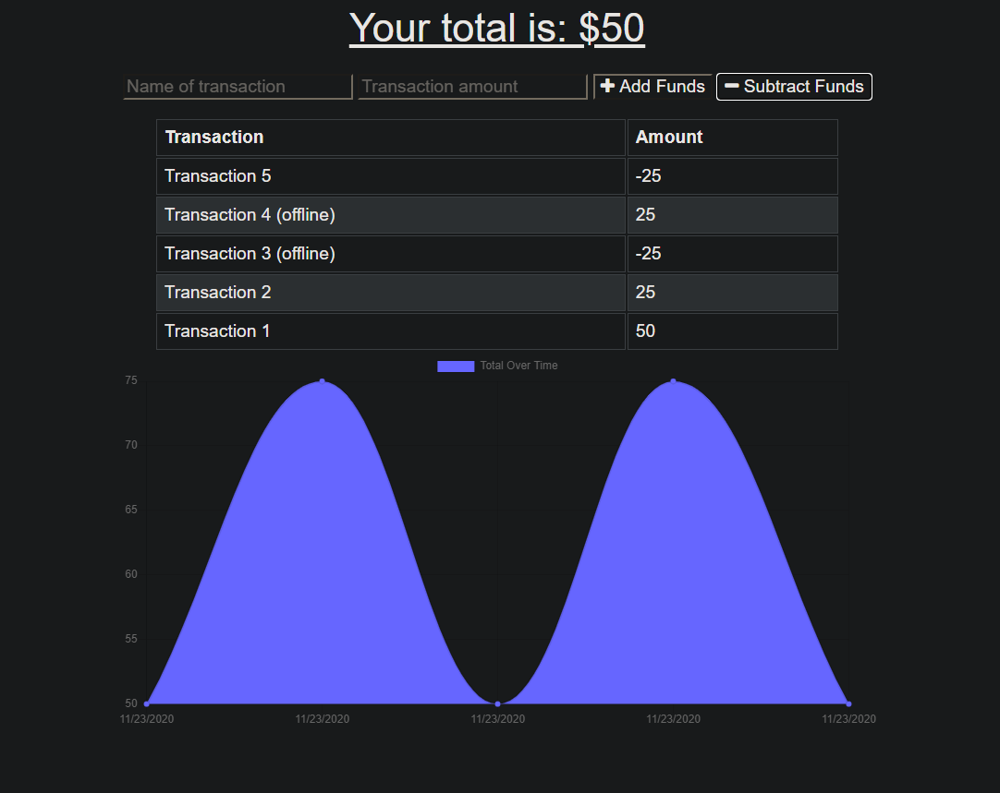

# Budget Tracker PWA 

### Project Links

This sit is deployed on Heroku [here](https://still-journey-37573.herokuapp.com/)

### Description

This budget tracker can be ran on and offline. It will save your transactions in an indexed db and will transfer that data over to a MongoDB when the user goes back online. It can also be installed to the machine and used as a PWA.

### Screenshot

### Challenges

a few of the challenges I came accross for this one was making sure that the application could be used as a PWA and making sure my manifest was being used appropriately and in the correct spot.

This project was authored by me [Zach LaFleur](https://github.com/MrCartree)